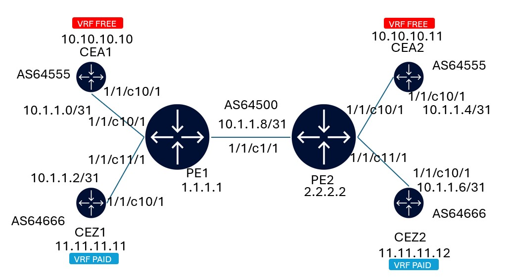

# SROS VPRN with Route Distribution based on BGP Communities

2 VRFs:
- FREE
- PAID

To see full config:

`admin show config`

To see VRF route table on PE:

VRF FREE:
`show router 100 route-table`

VRF PAID:
`show router 200 route-table`

To see route table on CE:

`show router route-table`

To see BGP route details:
On PE2:

`show router bgp routes vpn-ipv4`

`show router bgp routes 192.168.1.1/32 vpn-ipv4 detail`

`show router 200 bgp summary`

On CEZ2:

`show router bgp routes`

`show router bgp routes 192.168.1.1/32 detail`

To edit config:

`edit-config private`

To commit:

`commit`

